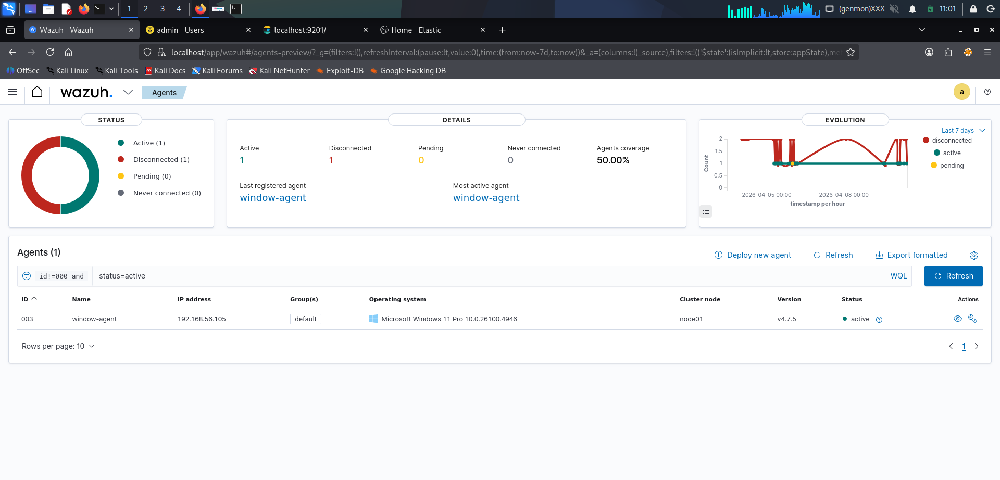
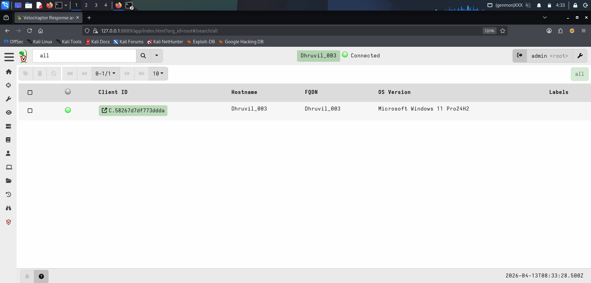
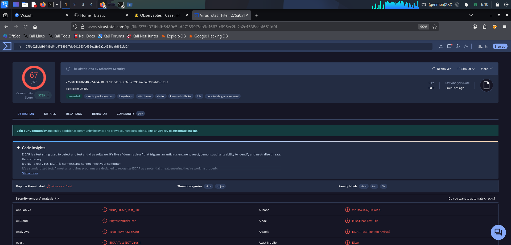
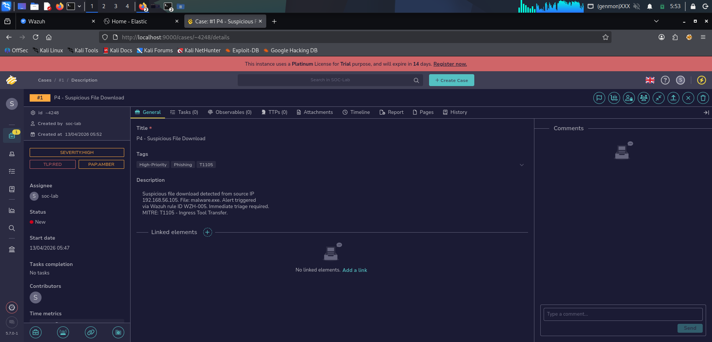
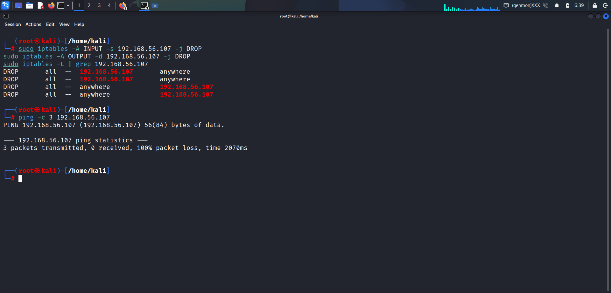

# 🛡️ SOC LAB — Week 4: Advanced SOC Operations

> **Date:** 2026-04-13

---

## 📋 Overview

This repository contains all documentation, screenshots, workflows, and reports for **Week 4 — Advanced SOC Operations**. The week covered advanced threat hunting, SOAR automation, post-incident analysis, adversary emulation, and a full capstone incident response exercise.

---

## 🖥️ Lab Environment

| Component | Tool/Version | Role |
|-----------|-------------|------|
| Attacker Machine | Kali Linux (192.168.56.102) | Penetration Testing |
| Target Machine | Metasploitable2 (192.168.56.107) | Vulnerable Target |
| Windows Endpoint | Windows 10 — Dhruvil_003 (192.168.56.105) | Log Source / Agent |
| SIEM | Wazuh v4.7.5 (Docker) | Alert Detection |
| Case Management | TheHive v5.7.0 (Docker) | Incident Tracking |
| EDR/Forensics | Velociraptor v0.75.6 | Endpoint Detection |
| Adversary Emulation | MITRE Caldera | TTP Simulation |
| Threat Intelligence | AlienVault OTX | IOC Lookup |
| Malware Analysis | VirusTotal | Hash Validation |
| IP Blocking | CrowdSec / iptables | Containment |
| Diagrams | Draw.io | Flowcharts / Fishbone |
| Documentation | Google Docs / Sheets | Reports / Metrics |

---

## 📁 Repository Structure

```
cyart-soc-team/
│
├── Week 4/
│   ├── README.md
│   ├── Week4_SOC_Final_Report.pdf
│   ├── Theory/
│   └── Practical/
```

## 🔁 End-to-End SOC Workflow

1. **Attack Simulation**
   - Exploited Metasploitable2 using Metasploit

2. **Detection**
   - Wazuh detected suspicious activity (Event ID 4672, alerts)

3. **Threat Hunting**
   - Investigated processes and network connections using Velociraptor (pslist, netstat)

4. **Threat Intelligence Validation**
   - Checked malicious IP/file hash using VirusTotal and OTX

5. **Case Management**
   - Created and managed incident in TheHive

6. **Response & Containment**
   - Blocked attacker IP using iptables

7. **Post-Incident Analysis**
   - Performed 5 Whys and Fishbone root cause analysis

8. **Metrics & Reporting**
   - Calculated MTTD, MTTR and created dashboard

9. **Final Reporting**
   - Documented findings and recommendations
     
---

### 📚 Theory Tasks
 
| # | Topic | Key Concepts Covered |
|---|-------|---------------------|
| T1 | Threat Hunting Methodologies | SqRR, TaHiTI, hypothesis-driven hunting |
| T2 | Advanced SOAR Automation | Playbook design, orchestration, SIEM integration |
| T3 | Post-Incident Analysis | RCA (5 Whys, Fishbone), MTTD/MTTR metrics |
| T4 | Adversary Emulation | Conceptual (MITRE Caldera studied)
| T5 | Security Metrics & Reporting | Dwell time, false positive rate, executive reporting |

---

## 🔧 Practical (Short Summary)

* **P1 — Threat Hunting:** Investigated processes, network connections, and validated IOCs using Velociraptor & OTX.
* **P2 — SOAR Playbook:** Designed automated phishing response workflow using Wazuh + TheHive.
* **P3 — Post-Incident Analysis:** Performed root cause analysis (5 Whys) and evaluated SOC metrics.
* **P4 — Alert Triage:** Analyzed suspicious file using VirusTotal and created TheHive case.
* **P5 — Evidence Analysis:** Collected and analyzed endpoint logs (process, network, process tree).
* **P6 — Adversary Emulation:** Simulated phishing attack using MITRE Caldera and identified detection gaps.
* **P7 — Security Metrics:** Created SOC KPI dashboard (MTTD, MTTR, false positives).
* **P8 — Capstone Project:** Simulated a real-world attack using Metasploit, detected via Wazuh, investigated with Velociraptor, validated using VirusTotal, managed in TheHive, and contained using iptables.

---

## 📊 Key Evidence







---

### Recommendations

1. Apply **CIS Benchmark** hardening baseline on all systems
2. Block all unused ports via strict **iptables/firewall policy**
3. Implement **automated SOAR** containment playbooks in TheHive
4. Deploy **monthly vulnerability scanning** using OpenVAS/Nessus
5. Conduct **quarterly adversary emulation** exercises with MITRE Caldera
6. Establish **patch management SLA** — critical patches within 72 hours
7. Implement **network segmentation** for lab and production systems

---

*This repository was created as part of the CYART SOC Analyst Training Program.*
*All activities were performed in an isolated lab environment for educational purposes only.*
